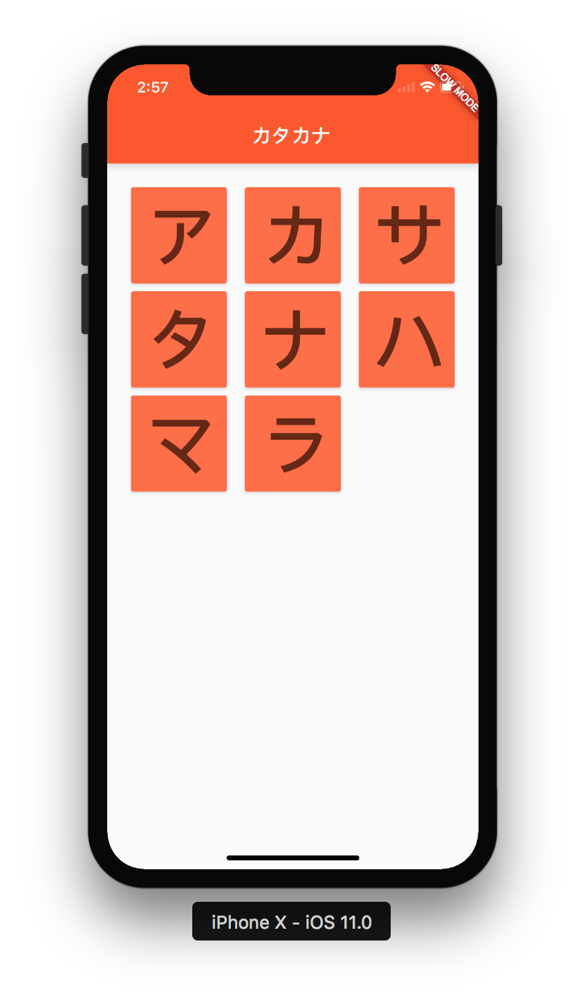
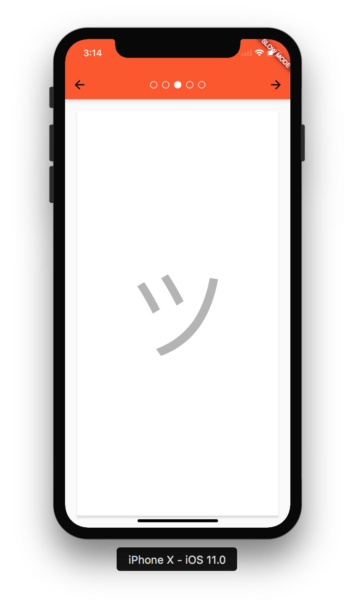
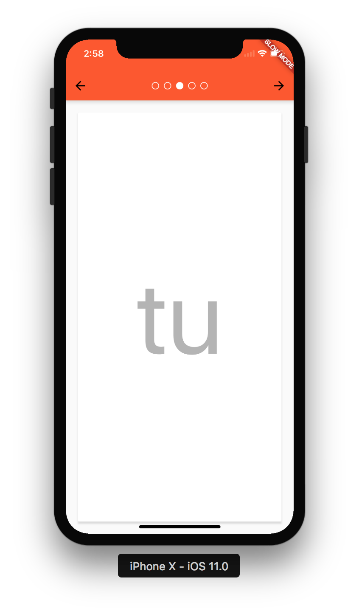

# katakana

### Learn how to read and pronounce Japanese characters
katakana is a cross-platform mobile app built with [Flutter](http://flutter.io/)

   

### Contributing 
Take a look at the current list of issues and call dibs by leaving a comment. 
Please fork this repo and make a pull request once you are done. 
Thanks and have fun :pray: 